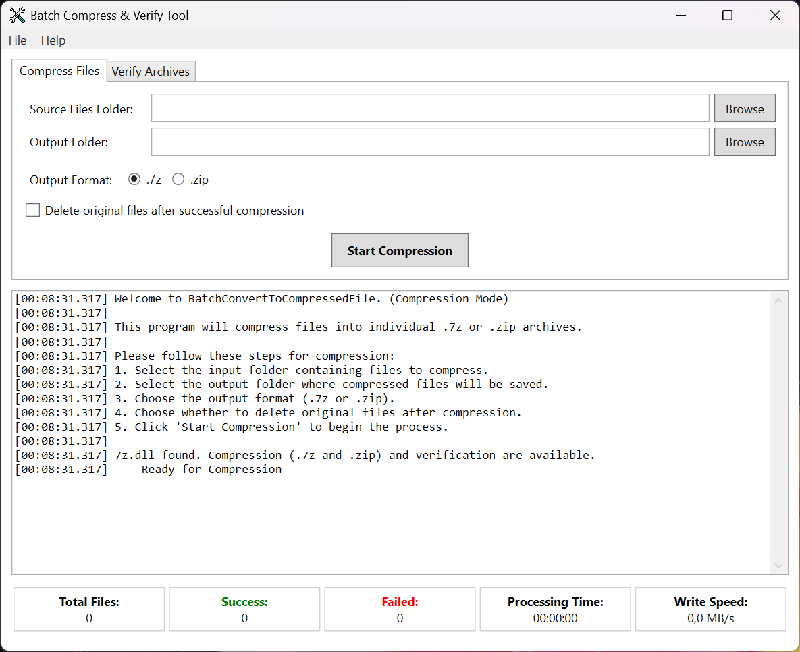
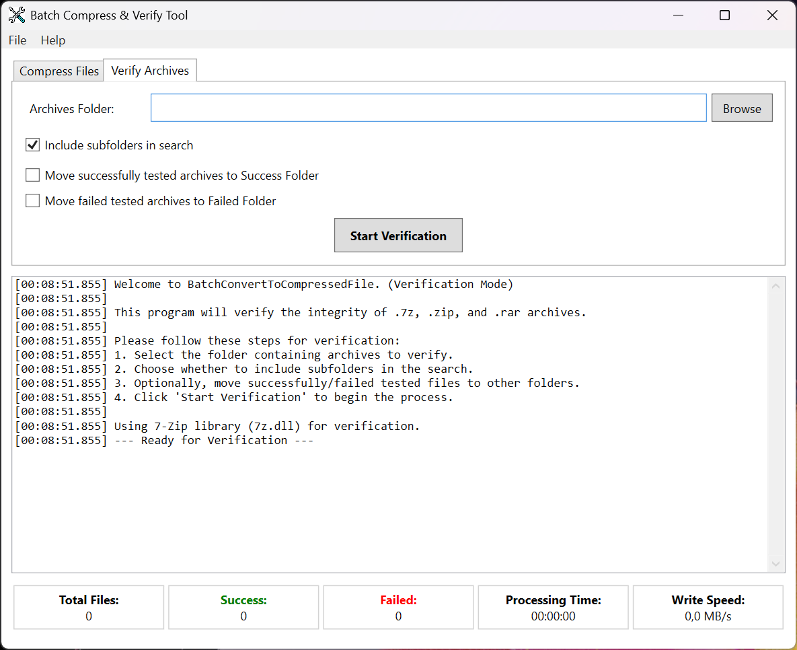

# Batch Convert to Compressed File
A Windows desktop utility for batch compressing files to `.7z` or `.zip` formats and for verifying the integrity of existing compressed archives.

## Overview
Batch Convert to Compressed File is a Windows application that provides a simple user interface for compressing multiple files into individual archives and verifying the integrity of existing compressed files.

## Features
- **Batch Compression**: Compress multiple files into individual archives in a single operation.
- **Multiple Format Support**: Create `.7z` archives or `.zip` archives.
- **Archive Verification**: Verify the integrity of `.7z`, `.zip`, and `.rar` archives with comprehensive CRC checking.
- **Progress Tracking**: Detailed progress indication, real-time logging, and write speed monitoring during operations.
- **Delete Original Option**: Option to remove source files after successful compression.
- **File Organization**: Automatically move verified archives to "Success" or "Failed" folders.
- **User-Friendly Interface**: Simple and intuitive tabbed Windows interface with real-time statistics.

## Supported File Formats

### Compression Output
- **.7z files** (7-Zip archives)
- **.zip files** (ZIP archives)

### Verification Support
- **.7z files** (7-Zip archives)
- **.zip files** (ZIP archives)
- **.rar files** (RAR archives)

## Requirements
- Windows 7 or later
- [.NET 9.0 Runtime](https://dotnet.microsoft.com/download/dotnet/9.0)
- `7z.dll` (included with the application)

## Installation
1. Download the latest release.
2. Extract the ZIP file to a folder of your choice.
3. Run `BatchConvertToCompressedFile.exe`.

## Usage

### Compressing Files
1. **Select the "Compress Files" tab**.
2. **Select Source Files Folder**: Click "Browse" next to "Source Files Folder" to select the folder containing files to compress.
3. **Select Output Folder**: Click "Browse" next to "Output Folder" to choose where the compressed files will be saved.
4. **Choose Output Format**: Select either the ".7z" or ".zip" format for the compressed archives.
5. **Delete Option**: Check "Delete original files after successful compression" if you want to remove source files after compression.
6. **Start Compression**: Click "Start Compression" to begin the batch process.
7. **Monitor Progress**: The application displays progress bars, write speed, and detailed log messages for each file during compression.
8. **Cancel (if needed)**: Click "Cancel" to stop the ongoing compression process gracefully.

### Verifying Archives
1. **Select the "Verify Archives" tab**.
2. **Select Archives Folder**: Click "Browse" next to "Archives Folder" to select the folder containing the archives to verify.
3. **Include Subfolders**: Check this option to recursively scan subdirectories for archives.
4. **Move Options**: Optionally configure moving successfully verified or failed archives to separate folders.
5. **Start Verification**: Click "Start Verification" to begin the verification process.
6. **Monitor Progress**: The application displays detailed verification results and statistics.

## About Compressed File Formats

### 7-Zip (.7z)
The 7z format is an open-source archive format that offers several advantages:
- **Superior Compression**: Often achieves better compression ratios than the ZIP and RAR formats.
- **Multiple Compression Methods**: Supports LZMA, LZMA2, and other advanced compression algorithms.
- **Strong Encryption**: AES-256 encryption support for secure archives.
- **Unicode Support**: Proper handling of international filenames.

### ZIP (.zip)
The ZIP format is a widely supported archive format that provides:
- **Universal Compatibility**: Supported natively by Windows and most operating systems.
- **Fast Compression**: Quick compression and decompression using built-in .NET libraries.
- **Wide Software Support**: Compatible with virtually all archive management tools.

## Why Use This Tool?
- **Save Time**: Batch process multiple files instead of compressing them one by one.
- **Save Disk Space**: Compressed files take up significantly less storage space.
- **Verify Integrity**: Ensure your archives are not corrupted and can be safely extracted.
- **Organize Files**: Automatically organize verified archives into "Success" and "Failed" folders.
- **Reliability**: Built-in error handling and comprehensive logging for troubleshooting.

## Troubleshooting
- Ensure `7z.dll` is present in the same directory as the application for .7z compression.
- Make sure you have appropriate permissions to read from the input and write to the output directories.
- Review the application log window for detailed error messages during operations.
- Automatic error reports will be sent to the developer if unexpected issues occur.
- For verification issues, ensure the archive files are not in use by other applications.

## ⭐ Support This Project
If you find this tool useful, please consider:

  **[⭐ Star this project on GitHub](https://github.com/drpetersonfernandes/BatchConvertToCompressedFile)** 
  **[💝 If you like this software, consider a donation](https://www.purelogiccode.com/donate/)**

Every star and donation is greatly appreciated and motivates us to keep creating helpful tools for the community!

## Acknowledgements
- Uses **7-Zip** (`7z.dll`) for archive creation and extraction.
- Developed by [Pure Logic Code](https://www.purelogiccode.com).

---
Thank you for using **Batch Convert to Compressed File**! For more information and support, visit [purelogiccode.com](https://www.purelogiccode.com).